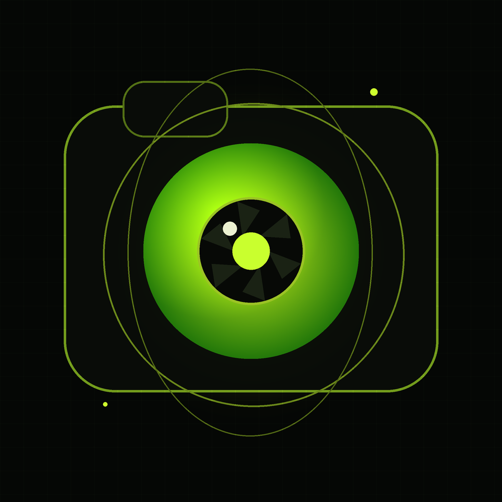

<p align="center">
  
</p>

<h1 align="center">IosCam</h1>

<p align="center"><strong>Native iPhone capture → USB → Windows → OBS or Windows 11 Media Foundation camera.</strong></p>

<p align="center">
  <a href="README_RU.md">🇷🇺 Русский</a> ·
  <a href="README_EN.md">🇬🇧 English</a>
</p>

---

IosCam is a zero-cost open-source webcam pipeline built around a native iOS capture app and a Windows receiver. The iPhone captures **1920×1080 at 60 FPS**, encodes H.264 with VideoToolbox, and sends it over the physical USB cable through Apple usbmux. Windows decodes the stream, applies optional image controls, and exposes a stable **`IosCam Preview`** window that can be captured by OBS and published as **OBS Virtual Camera**.

```text
iPhone camera
    ↓  AVCaptureSession 1080p60
VideoToolbox H.264
    ↓
TCP :2345 over USB / Apple usbmux
    ↓
IosCam Windows receiver
    ↓
Windows filters + IosCam Preview
    ↓
OBS Window Capture
    ↓
OBS Virtual Camera
    ↓
Browser / Discord / chat site / video app
```

### Current features

- Native iOS capture and hardware H.264 encoding
- USB-only runtime transport; Wi-Fi is not required for video
- 1080p60 target mode
- Rear Wide, Ultra Wide, Telephoto and Front camera selection where supported
- Zoom, exposure bias, autofocus and manual focus control from Windows
- Blur, brightness, contrast, saturation, sharpness, mirror and rotation on Windows
- Live FPS / bitrate / queue / drop / receiver-latency telemetry
- One-click Windows launcher: `start_ioscam.bat`
- Two output modes: `start_ioscam_obs.bat` and `start_ioscam_native.bat`
- Tear-resistant double-buffered preview for OBS Window Capture
- Optional Windows 11 Media Foundation compatibility camera via OBS2MF
- OBS-friendly stable preview window title: `IosCam Preview`
- Free unsigned IPA build through GitHub Actions

### Tested configuration

The project was developed and end-to-end tested with **iPhone 12 Pro**, **iOS 26.6.1**, **Windows 11 x64**, a data-capable Lightning cable, Python 3.12+, Apple Mobile Device Service, and OBS Studio. The Xcode project has an iOS 17.0 deployment target, but other device/model combinations have not all been validated.

> This is an experimental creator tool, not an Apple/OBS product. Camera availability and 1080p60 support depend on the physical iPhone model.

### Documentation

| Language | Overview | Full install | Troubleshooting |
|---|---|---|---|
| 🇷🇺 Русский | [README_RU.md](README_RU.md) | [docs/INSTALL_RU.md](docs/INSTALL_RU.md) | [docs/TROUBLESHOOTING_RU.md](docs/TROUBLESHOOTING_RU.md) |
| 🇬🇧 English | [README_EN.md](README_EN.md) | [docs/INSTALL_EN.md](docs/INSTALL_EN.md) | [docs/TROUBLESHOOTING_EN.md](docs/TROUBLESHOOTING_EN.md) |

### Project status / limitations

- Video only; microphone/audio transport is not implemented yet.
- Current capture target is 1080p60, not 4K60.
- Blur is whole-frame blur, not person/background segmentation.
- The latency counter is receiver-side RX→screen latency, not full glass-to-glass latency.
- Receiver startup now waits for a clean H.264 IDR and requests a fresh keyframe when the PC connects.
- The optional Media Foundation path is still a software/virtual camera; it does not spoof physical hardware identity.

### License

IosCam project source is released under the [MIT License](LICENSE). Third-party dependencies keep their own licenses; see [THIRD_PARTY_NOTICES.md](THIRD_PARTY_NOTICES.md).
